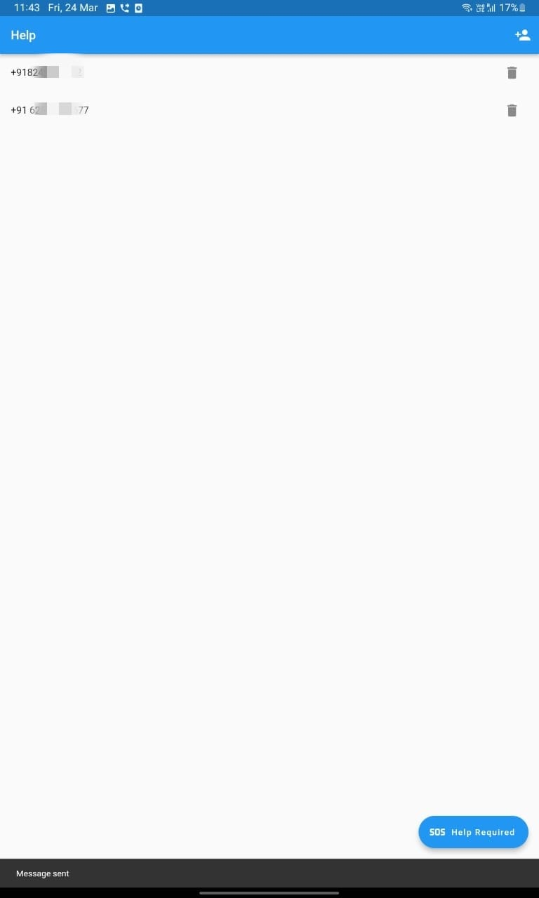
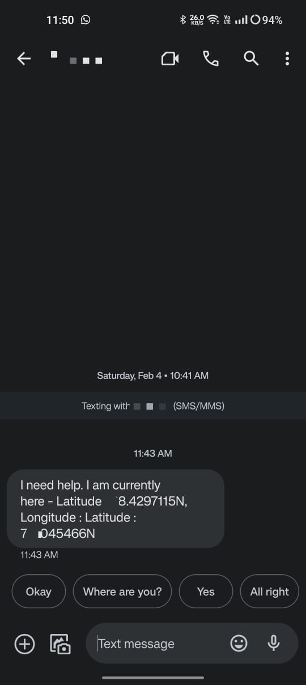

# SOS Application

POC for a SOS application

# Dependencies Used

- [Permission Handler](https://pub.dev/packages/permission_handler)
- [Shared Preferences](https://pub.dev/packages/shared_preferences)
- [Flutter Contacts](https://pub.dev/packages/flutter_contacts)
- [Geolocator](https://pub.dev/packages/geolocator)
- [Telephony](https://pub.dev/packages/telephony#send-sms)

# Screenshots

